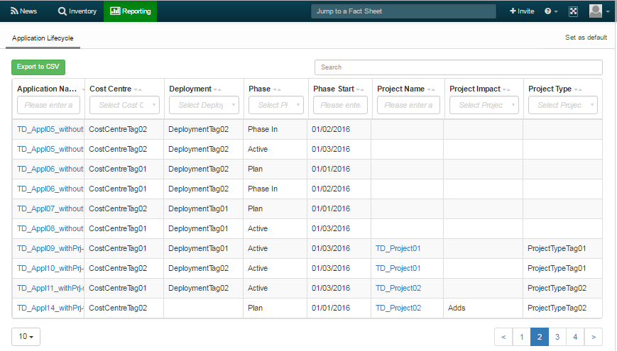

# scope/content

The table report shows all applications with lifecyle informations. The user gets an overview of the lifecycles, status and so on and the information about the projects having impact to the applications respectively lifecycle phases.

# source code

[https://github.com/leanix/leanix-custom-reports/blob/master/vtables/src/js/ReportApplicationLifecycle.js](https://github.com/leanix/leanix-custom-reports/blob/master/vtables/src/js/ReportApplicationLifecycle.js) 

# screenshot

# requirements

1.  workspace has TagGroups 'Project Type', 'Deployment' and 'CostCentre'
1.  table report with columns  
	* **Application Name**: "name"
	* **Cost Centre**: "costCentre"
	* **Deployment**: "deployment"
	* **Phase**: "lifecyclePhase"
	* **Phase Start**: "lifecycleStart"
	* **Project Name**: "projectName"
	* **Project Impact**: "projectEffect"
	* **Project Type**: "projectType"
1.  filter in each column
1.  button 'Export CSV'
1.  search
1.  applications and projects are links to leanIX-Factsheets
1.  avoid cuts in the column names (nice column width)

## rules to fill rows

1.  in general: Only applications with the tag *Applications*
1.  list all applications and their lifecycle-phases (vector product)
	1.  initialy one row for each combination
	1.  if application-lifecycle-comb. has relation to project --> with project informations according to further described rules
		*  if more then one project fits --> one row for each project
    1.  if application-lifecycle-comb. does not have relation to project --> without *projectName*, *projectEffect*, *projectType*
1.  Don't show applications without lifecycle informations
1.  the rules to append rows with project informations:
	1. Appl.-Lifecycle **Plan** or **Phase In**: Add 1 row for each project without *Decomissioning* in his name and the impact *adds*
	1. Appl.-Lifecycle **Active**: Add 1 row for each project without *Decomissioning* in his name and the impact *adds*, *modifies* or without impact
	1. Appl.-Lifecycle **Phase Out** or **End of Life**:
		* Add 1 row for each project with the string *Decommissioning* in project name (impact is not relevant)
		* Add 1 row for each project without *Decomissioning* in his name and the impact 'sunsets'
