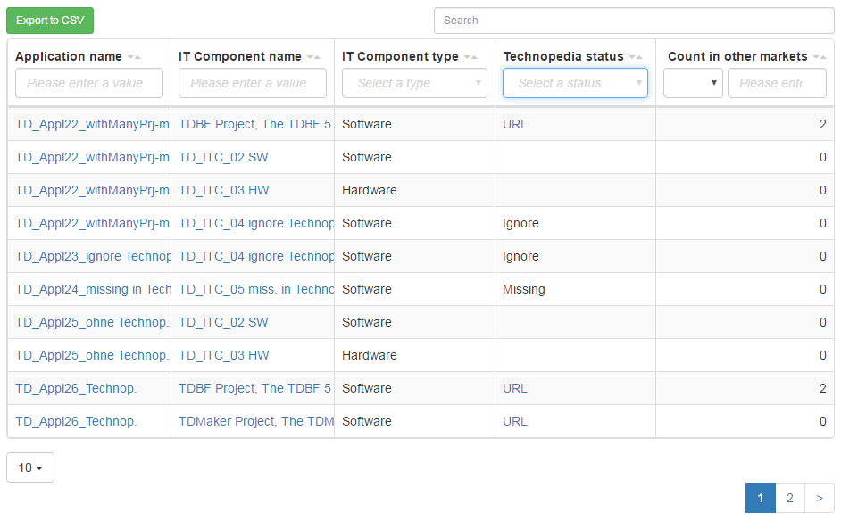

# scope/content

The table report shows an overview of applications and their current usage of Technopedia.

# source code

[https://github.com/leanix/leanix-custom-reports/blob/master/vtables/src/js/ReportTechnopedia.js](https://github.com/leanix/leanix-custom-reports/blob/master/vtables/src/js/ReportTechnopedia.js) 

# screenshot

# requirements

1.  table report with columns  

    **Application Name** with Link zu Factsheet
    **IT Component Name** with Link zu Factsheet
    **IT Component Type** (Service, Software, Hardware)  
    **Technopedia Status** (1. URL, 2. Ignore, 3. Missing, 4. Blank (should be displayed as an empty string))
    **Count in other markets** using this IT Component (If the application is called XXName (XX is for the market, naming convention with is valid for all apps), count all applications with prefix != XX_ referenced by the same IT Component)

1.  no colum for / filter by 'Market' (will be done via application prefix)
	
1.  filter in each column
1.  button 'Export CSV'
1.  search
1.  one row for each application
1.  one row for each combination (application -- it component)
1.  only applications with the tag 'Applications'
